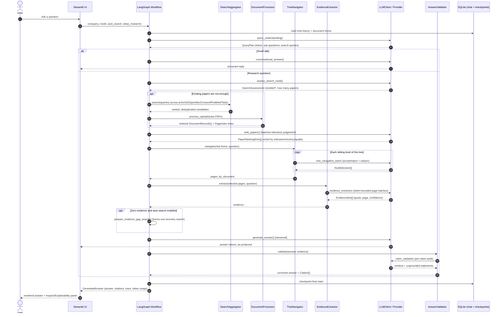
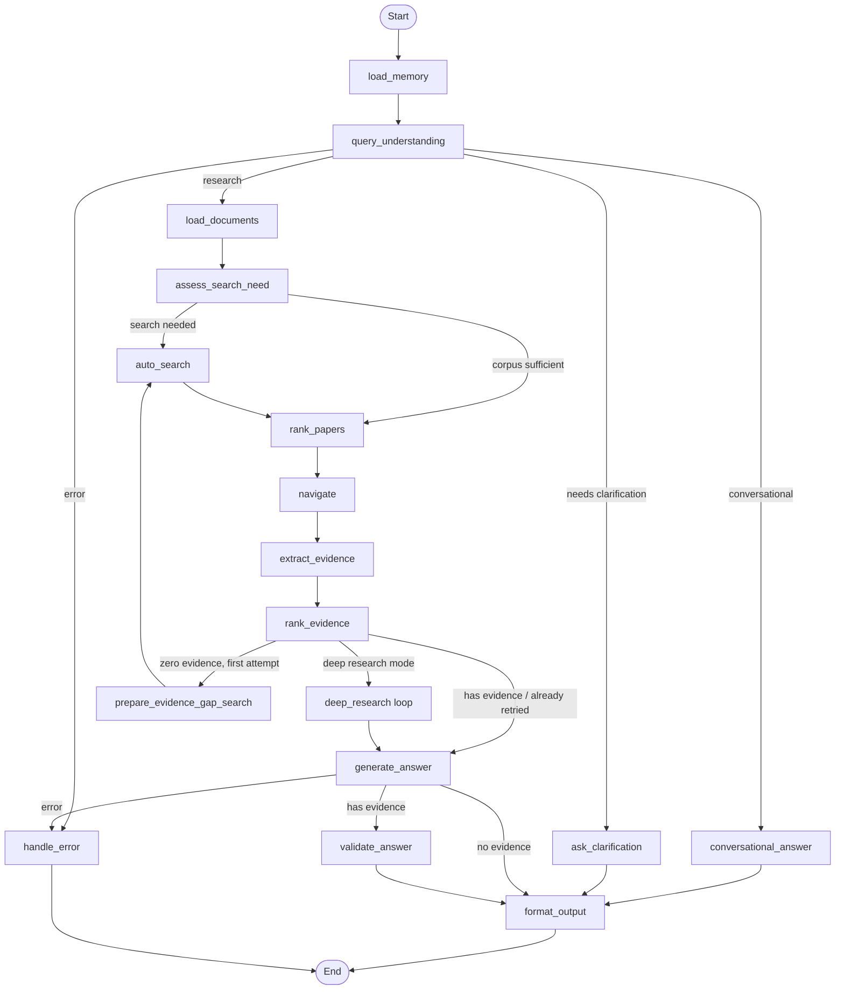
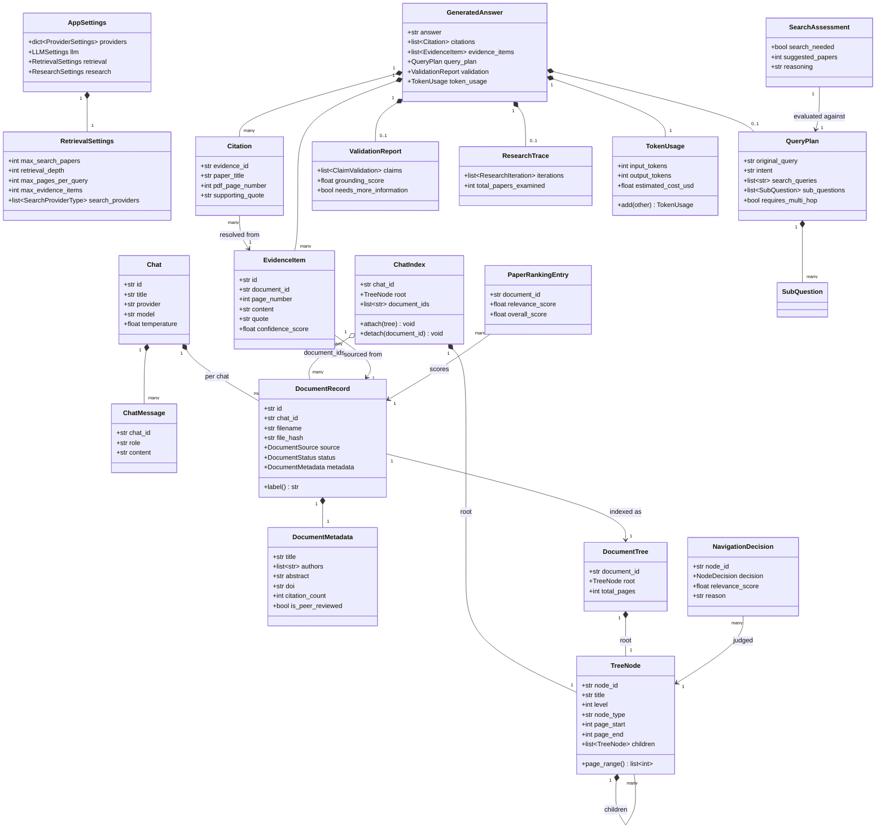
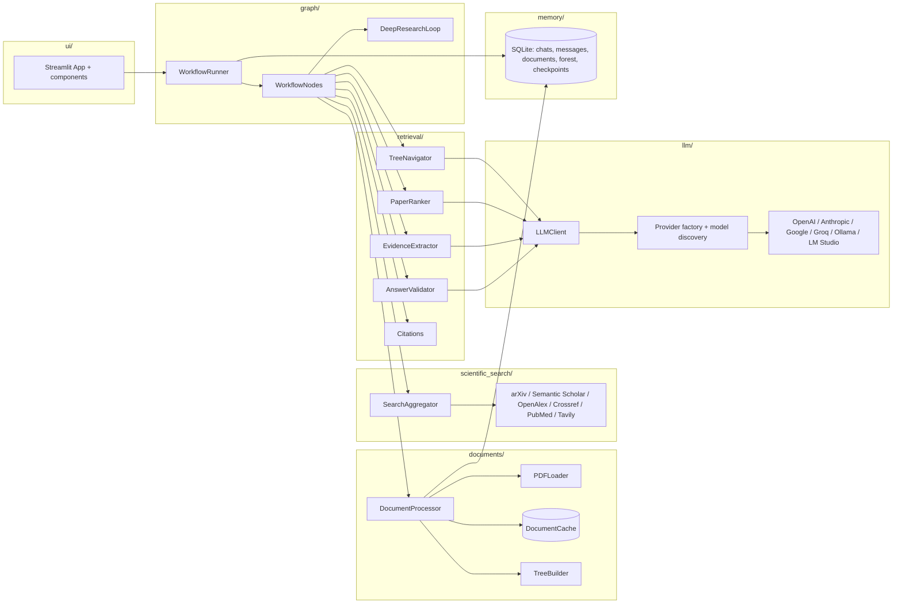

# Scientific RAG

**Vectorless RAG for scientific papers.** Ask questions across a library of PDFs and get
answers where every sentence is traceable to a page you can open and read yourself.

There are no embeddings, no vector database and no similarity search anywhere in this
project. Retrieval is performed by an LLM reasoning over a hierarchical document tree,
in the spirit of [PageIndex](https://github.com/VectifyAI/PageIndex).

---

## Why vectorless

Classical RAG chops a paper into fixed-size chunks, embeds them and retrieves whatever is
closest in cosine distance. For scientific literature that fails in predictable ways:

| Problem with chunk-and-embed | What Scientific RAG does instead |
| --- | --- |
| Chunks cut across section boundaries, splitting a method from its equations | The tree respects the paper's real structure: sections, subsections, page ranges |
| "Closest vector" is not "actually answers the question" | An LLM reads section titles and summaries and *decides* which parts to open, with a written reason |
| No explanation of why a passage was retrieved | Every navigation decision is shown to you: node, verdict, score, reasoning |
| Re-indexing a corpus means re-embedding everything | Adding a paper attaches one subtree; nothing else is touched |
| Citations are attached after the fact and often wrong | Evidence carries its exact page; fabricated citation markers are stripped before you see the answer |

The trade-off is honest: vectorless retrieval spends LLM tokens where classical RAG spends
GPU memory. For a research assistant working over tens of papers, that is the right trade.

---

## The document forest

A chat owns exactly one tree. The root is the chat's knowledge base, each PDF becomes a
**level-1 node**, and the paper's own structure hangs below it:

```
Chat Knowledge Base                          <- root, level 0
├── Attention Is All You Need.pdf            <- level 1, node_type="document"
│   ├── 1. Introduction            p. 1-2    <- level 2, node_type="section"
│   ├── 3. Model Architecture      p. 3-6
│   │   ├── 3.1 Encoder and Decoder Stacks   <- level 3
│   │   └── 3.2 Attention          p. 4-5
│   └── 4. Why Self-Attention      p. 6-7
└── AlphaFold: Protein Structure.pdf         <- level 1, sibling of the first paper
    ├── Background                 p. 1-3
    └── Results                    p. 4-9
```

Add a third PDF and it becomes a third level-1 sibling. The existing subtrees are never
rebuilt - `ChatIndex.attach()` grafts a new document on, `ChatIndex.detach()` removes one.
Because each chat has its own root, papers never leak between conversations.

Retrieval walks this forest top-down. At each level the model is shown the children and
asked which are worth opening for *this* question; rejected branches are pruned with a
recorded reason, and only the surviving pages are ever read in full.

---

## How a question is answered

```
question
   |
   v
[load memory] -> [understand query] -> conversational? -> [chat reply]
   |
   v
[load documents] -> [auto-search] -> [rank papers]
   |
   v
[navigate the forest]   <- LLM picks sections, records reasons
   |
   v
[extract evidence]      <- verbatim quotes + page numbers + confidence
   |
   v
[deep research loop]?   <- find gaps, search again, repeat (up to 3 rounds)
   |
   v
[generate answer] -> [validate claims] -> [format + bibliography]
```

The whole pipeline is a LangGraph state machine with SQLite checkpointing, so a run can be
resumed and every intermediate state is inspectable.

---

## Architecture diagrams

These render directly on GitHub. For a deeper written walkthrough of every module, see the
full project documentation in [`document/`](document/ARCHITECTURE.md).

### Sequence diagram - answering one question



### Workflow state machine



### Domain model (UML class diagram)



### Component / module architecture



---

## Features

- **PDF library per chat** - drag in papers, or let the app find them for you.
- **Automatic paper discovery** across arXiv, Semantic Scholar, OpenAlex, Crossref, PubMed
  and Tavily; results are de-duplicated by DOI and title, then ranked for relevance.
- **Deep research** - iterative gap analysis: the model reads what it has, works out what is
  missing, searches for it, indexes it and reads again.
- **Grounded answers** - claims without evidence are removed, not politely hedged.
- **Explainability panel** - citations, evidence quotes, the navigation tree with accept and
  reject reasons, paper ranking scores, claim-by-claim verification, tokens and cost.
- **Citations in APA, IEEE and BibTeX**, with a generated bibliography.
- **Isolated chat memory** - each conversation keeps its own history and documents. Across
  chats the app remembers only *themes* ("you have been reading about protein folding"),
  never the content of another conversation.
- **Any model** - OpenAI, Anthropic, Google, Groq, Ollama and LM Studio. Model lists are
  fetched live from each provider; nothing is hardcoded.
- **Export** to Markdown or PDF.

---

## Installation

Requires **Python 3.10+** (developed on 3.12). Works on Linux, macOS and Windows.

### Linux / macOS

```bash
git clone <repository-url> scientific_rag
cd scientific_rag
python3 -m venv .venv
source .venv/bin/activate
pip install -r src/requirements.txt
python app.py
```

### Windows (PowerShell)

```powershell
git clone <repository-url> scientific_rag
cd scientific_rag
py -3 -m venv .venv
.\.venv\Scripts\Activate.ps1
pip install -r src\requirements.txt
python app.py
```

### Windows (one-click installer)

Prefer not to type commands? Download or clone the repository, then double-click
[`installer\install.bat`](installer/install.bat). It checks for Python 3.10+, creates the
virtual environment, installs every dependency, prepares `.env` and the database, writes a
`Run Scientific RAG.bat` launcher, and offers to add a Desktop shortcut - no Administrator
rights required. A traditional `Setup.exe` wizard (built with Inno Setup) is also available;
see [`installer/README.md`](installer/README.md) for both options and
[`installer/uninstall.bat`](installer/uninstall.bat) to remove them again.

`app.py` prepares the application directory, configures logging, creates the SQLite
database and its tables, then launches Streamlit at <http://localhost:8501>. **No manual
database setup is needed** - the schema is created before the UI accepts input. If you want
to prepare storage separately, run `python init_database.py`.

### Running Streamlit directly

`python app.py` is the recommended way to start the app - it also prepares the database and
directories before Streamlit starts. If you prefer to invoke Streamlit yourself (e.g. to pass
extra Streamlit flags), it also works from inside `src/`, since `streamlit_app.py` prepares
its own `sys.path` and initialises the database on first use:

```bash
cd src
python -m streamlit run ui/streamlit_app.py
```

---

## Configuration

Copy `.env.example` to `.env` and fill in the providers you use, or open the **Settings**
page in the app and paste keys there. Settings are written to a file with `0600`
permissions inside the application home:

| Platform | Application home |
| --- | --- |
| Linux | `$XDG_DATA_HOME/scientific_rag` or `~/.scientific_rag` |
| macOS | `~/Library/Application Support/ScientificRAG` |
| Windows | `%LOCALAPPDATA%\ScientificRAG` |

Set `SCIENTIFIC_RAG_HOME` to override it. Environment variables always take precedence over
the settings file, so containers and CI can inject keys without writing to disk.

### Local models

No API key is required for local runtimes:

```bash
ollama serve && ollama pull qwen3:8b      # Ollama, default http://localhost:11434
```

or start LM Studio's server (default `http://localhost:1234/v1`). Open Settings, choose the
provider, and the model dropdown fills with whatever you have installed. For local models
the app automatically falls back to JSON-parsed structured output when the runtime does not
support native tool calling.

### Search providers

arXiv, OpenAlex, Crossref and PubMed need no key. Semantic Scholar works without one but is
rate-limited. Tavily requires `TAVILY_API_KEY` and is hidden from the UI until you set it.
Setting `SCIENTIFIC_RAG_CONTACT_EMAIL` puts you in the polite request pool of OpenAlex,
Crossref and PubMed, which is noticeably faster.

---

## Using the app

1. **New chat** in the sidebar.
2. **Upload PDFs**, or enable *Auto-search* and let the app find papers for your question.
3. Pick an **answer style**: short answer, research report, or deep research.
4. Ask. Tokens stream in as they are produced.
5. Open **Details** under the answer to inspect citations, evidence, the retrieval tree,
   ranking, verification and cost.
6. **Export** the answer or the whole conversation to Markdown or PDF.

Toggles in the sidebar:

- **Explainability** - record and display retrieval reasoning (slightly more tokens).
- **Auto-search** - discover and index new papers when the library is thin.
- **Deep research** - multi-round gap-driven investigation. Implies auto-search.

---

## Project layout

```
app.py                      cross-platform launcher
init_database.py            optional explicit storage setup
.env.example                environment template
src/
  config/                   settings manager, provider catalogue (providers.yaml)
  core/                     constants, enums, exceptions, domain models
  documents/                PDF loading, parsing, metadata extraction, content cache
  export/                   Markdown and PDF export
  graph/                    LangGraph state, nodes, deep research, checkpoints
  llm/                      provider adapters, model discovery, usage tracking, client
  memory/                   SQLite schema, repositories, chat and global memory
  observability/            structured JSON logging with secret redaction
  prompts/                  prompt manager + every prompt as a Markdown file
  retrieval/
    pageindex/              tree builder, navigator, chat forest
    evidence.py             evidence extraction and selection
    ranking.py              paper relevance ranking
    citations.py            citation renumbering and formatting
    validation.py           claim verification and ungrounded-claim removal
  scientific_search/        six search providers + aggregator + PDF downloader
  ui/                       Streamlit app, components, settings page
  tests/                    pytest suite
```

Two rules keep this maintainable: **no prompt text lives in a `.py` file** (every prompt is
a Markdown file under `src/prompts/`), and **no module outside `src/llm/` imports a provider
SDK** (everything goes through `LLMClient`).

---

## Testing

```bash
source .venv/bin/activate        # Windows: .\.venv\Scripts\Activate.ps1
cd src
python -m pytest -q
```

The suite runs offline - no API keys, no network - and covers PDF parsing and heading
inference, metadata handling, forest construction and incremental attach/detach, navigation
budgeting, paper ranking, evidence de-duplication and selection, citation renumbering and
formatting, hallucinated-citation removal, chat memory isolation, and provider and prompt
configuration.

---

