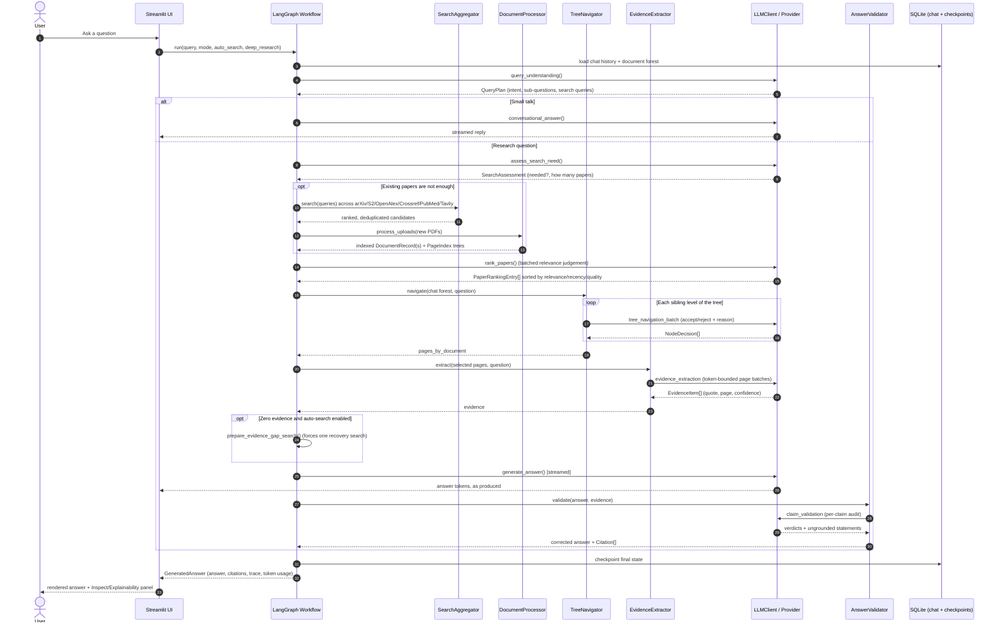
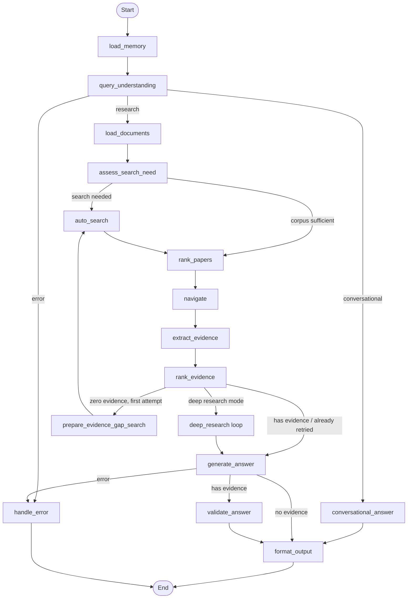
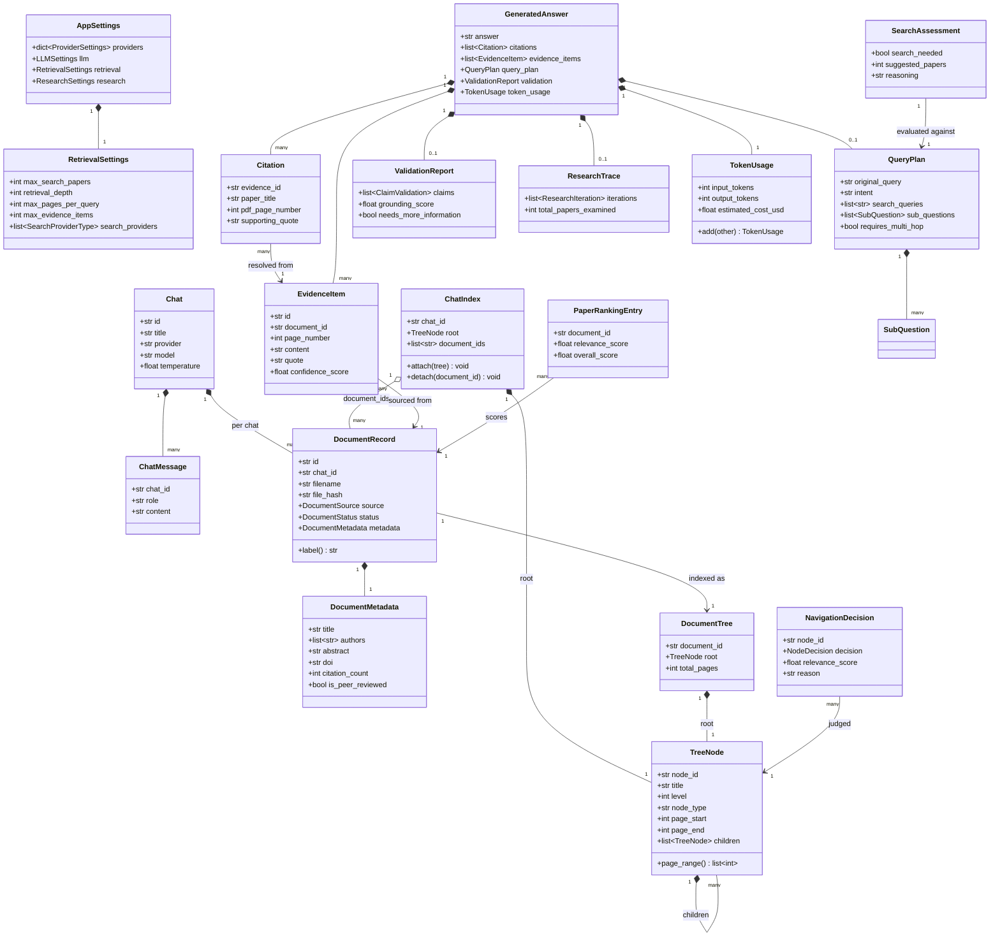
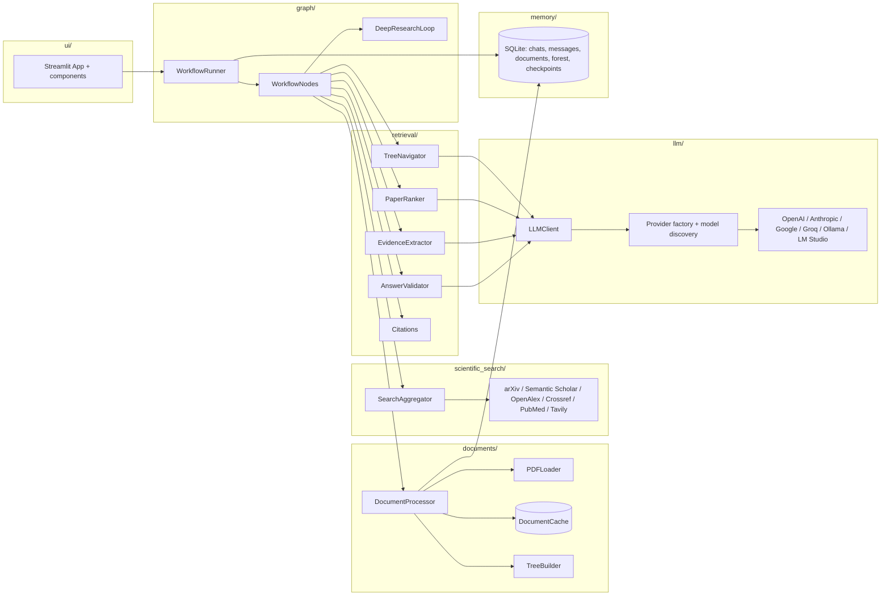

# Scientific RAG - Project Documentation

A complete technical reference for the Scientific RAG codebase: architecture, configuration,
workflow internals, domain model, persistence, and setup. The [README](../README.md) is the
quick-start entry point; this document is the deep dive.

## Table of contents

1. [Overview and philosophy](#1-overview-and-philosophy)
2. [Installation and setup](#2-installation-and-setup)
3. [Configuration reference](#3-configuration-reference)
4. [High-level architecture](#4-high-level-architecture)
5. [The LangGraph workflow](#5-the-langgraph-workflow)
6. [Domain model reference](#6-domain-model-reference)
7. [Persistence layer](#7-persistence-layer)
8. [Retrieval internals](#8-retrieval-internals)
9. [Scientific search providers](#9-scientific-search-providers)
10. [LLM provider layer](#10-llm-provider-layer)
11. [User interface](#11-user-interface)
12. [Testing](#12-testing)
13. [Diagrams](#13-diagrams)

---

## 1. Overview and philosophy

Scientific RAG is a **vectorless** retrieval-augmented generation application for reading
and reasoning over scientific papers. Instead of chunking documents into embeddings and
running similarity search, it builds a **PageIndex**: a hierarchical outline (the "document
forest") that mirrors each paper's actual section structure. An LLM navigates that forest the
way a researcher would - reading a table of contents, deciding which sections are relevant,
opening only those pages - and every claim in the final answer is traceable back to a verbatim
quote, page number and citation.

Each chat is an isolated workspace: its own uploaded/auto-discovered PDFs, its own PageIndex
forest, its own message history. The assistant is given only *topic-level* awareness of other
chats (e.g. "the user has also been discussing protein folding elsewhere"), never their
content, so conversations do not leak into each other.

Core design goals:

- **Traceability** - every sentence in an answer that makes a factual claim carries a
  citation resolvable to a page number and quote.
- **Groundedness over completeness** - claims that cannot be supported by retrieved evidence
  are removed by the validation step rather than kept with a disclaimer.
- **Resumability** - the whole answer pipeline is a LangGraph state machine checkpointed to
  SQLite, so a run's intermediate state is always inspectable and could be resumed.
- **Provider agnostic** - six LLM backends (OpenAI, Anthropic, Google Gemini, Groq, Ollama,
  LM Studio) and six search backends (arXiv, Semantic Scholar, OpenAlex, Crossref, PubMed,
  Tavily) are supported through the same adapter interfaces.
- **Honest failure reporting** - only provider rate/quota-limit conditions are ever surfaced
  to the user as a warning; every other internal failure (parser errors, transient network
  issues, indexing problems) is logged for diagnostics but never leaked into the answer text.

---

## 2. Installation and setup

### Linux / macOS

```bash
git clone <repository-url> scientific_rag
cd scientific_rag
python3 -m venv .venv
source .venv/bin/activate
pip install -r src/requirements.txt
python app.py
```

### Windows

Two options, both documented in detail in [`installer/README.md`](../installer/README.md):

- **`installer/install.bat`** - a self-contained batch installer. Double-click it; it verifies
  Python 3.10+, creates `.venv`, installs `src/requirements.txt`, prepares `.env` and the
  database, writes a `Run Scientific RAG.bat` launcher, and offers a Desktop shortcut. No
  Administrator rights are required. `installer/uninstall.bat` reverses it.
- **`installer/scientific_rag.iss`** - an [Inno Setup](https://jrsoftware.org/isinfo.php)
  script that, once compiled with `ISCC.exe` on a Windows machine, produces a traditional
  `ScientificRAG-Setup-<version>.exe` wizard with Start Menu/Desktop shortcuts and an
  "Add or Remove Programs" entry. It runs `install.bat` internally to prepare the Python
  environment.

Or manually, equivalent to the Linux/macOS steps:

```powershell
git clone <repository-url> scientific_rag
cd scientific_rag
py -3 -m venv .venv
.\.venv\Scripts\Activate.ps1
pip install -r src\requirements.txt
python app.py
```

### What `app.py` does

`app.py` is the single cross-platform entry point. On every launch it calls `prepare()`,
which:

1. `ensure_directories()` - creates the per-OS application-home folder tree (settings,
   database, document cache, exports, logs).
2. `configure_logging()` - sets up structured JSON file logging plus console output.
3. `init_database()` - creates the SQLite database file and every table if they do not
   already exist (safe to call on every start; no destructive migration is performed).
4. Launches Streamlit as a subprocess: `python -m streamlit run src/ui/streamlit_app.py
   --server.headless=false --browser.gatherUsageStats=false`, serving the UI at
   <http://localhost:8501>.

Running `python init_database.py` directly performs the same database initialisation
without starting the UI - useful for scripted or headless setups.

---

## 3. Configuration reference

### Where data lives (`core/constants.py: _resolve_app_home()`)

| Platform | Default application home | Override |
|---|---|---|
| Windows | `%LOCALAPPDATA%\ScientificRAG` (falls back to `%APPDATA%`, then `~\AppData\Local\ScientificRAG`) | `SCIENTIFIC_RAG_HOME` |
| macOS | `~/Library/Application Support/scientific_rag` | `SCIENTIFIC_RAG_HOME` |
| Linux | `$XDG_DATA_HOME/scientific_rag` or `~/.scientific_rag` | `SCIENTIFIC_RAG_HOME` |

Inside that folder: `settings.json` (persisted `AppSettings`), the SQLite database, a document
cache for downloaded/uploaded PDFs, export output, and log files.

### Environment variables (`.env` / `.env.example`)

`SettingsManager._load_dotenv()` loads a `.env` file from (in order) the current working
directory, the project root, or the application home, without overriding values already set
in the process environment. Environment variables always take precedence over values saved
through the Settings page for credentials.

| Variable | Purpose |
|---|---|
| `OPENAI_API_KEY` | OpenAI credential |
| `ANTHROPIC_API_KEY` | Anthropic credential |
| `GOOGLE_API_KEY` | Google Gemini credential |
| `GROQ_API_KEY` | Groq credential |
| `OLLAMA_BASE_URL` | Local Ollama endpoint (default `http://localhost:11434`) |
| `LMSTUDIO_BASE_URL` | Local LM Studio endpoint (default `http://localhost:1234/v1`) |
| `TAVILY_API_KEY` | Required only if the Tavily web-search provider is enabled |
| `SEMANTIC_SCHOLAR_API_KEY` | Optional; raises the Semantic Scholar rate limit |
| `SCIENTIFIC_RAG_CONTACT_EMAIL` | Sent as a polite-pool identifier to OpenAlex/Crossref/PubMed |
| `SCIENTIFIC_RAG_HOME` | Overrides the application-home directory on any OS |

### Persisted settings (`AppSettings`, saved as `settings.json`)

| Section | Key fields |
|---|---|
| `providers` (`dict[str, ProviderSettings]`) | `api_key`, `base_url`, `enabled`, `selected_model` per LLM provider |
| `llm` (`LLMSettings`) | `temperature`, `max_tokens`, `top_p`, `streaming`, `system_prompt` |
| `retrieval` (`RetrievalSettings`) | `max_search_papers`, `search_providers`, `retrieval_depth`, `toc_check_pages`, `max_pages_per_query`, `max_evidence_items`, `download_pdfs` |
| `interface` (`InterfaceSettings`) | `theme`, `streaming_enabled`, `show_token_usage` |
| `research` (`ResearchSettings`) | `citation_format`, `default_answer_mode`, `deep_research_iterations`, `strict_grounding`, `show_retrieval_reasoning`, `auto_search_default`, `deep_research_default` |
| top level | `active_provider`, `tavily_api_key`, `semantic_scholar_api_key`, `contact_email` |

All of these are also editable from the Settings page in the UI; the JSON file is simply the
persisted form.

---

## 4. High-level architecture

```
src/
├── config/          Settings persistence (settings.json) + provider/model catalog
├── core/             Constants, enums, custom exceptions, all Pydantic models
├── documents/        PDF loading/validation, parsing (text/figures/tables/outline), the
│                     document processing pipeline, and a local file cache
├── export/           Markdown/PDF export of chats and answers
├── graph/            The LangGraph workflow: state, nodes, routing, deep research loop,
│                     SQLite checkpointing, run context
├── llm/               Provider adapters (OpenAI/Anthropic/Google/Groq/Ollama/LM Studio),
│                     the factory, and a unified streaming LLMClient
├── memory/           SQLAlchemy models/engine, repositories, chat/global memory summarisation
├── observability/    Structured JSON logging with secret redaction
├── prompts/          Versioned prompt templates, loaded and cached by PromptManager
├── retrieval/        Tree navigation, evidence extraction, ranking, answer validation,
│                     citation building; `pageindex/` builds the forest from parsed PDFs
├── scientific_search/ Provider-specific search clients + result aggregation + PDF download
└── ui/               Streamlit app, pages, and reusable components (chat panel, sidebar,
                      trace/explainability panel)
```

See the [component diagram](#component--module-architecture) below for how these depend on
one another at runtime.

---

## 5. The LangGraph workflow

The entire answer-generation pipeline is one compiled `StateGraph` (`graph/graph_builder.py:
build_graph`), executed once per user turn by `WorkflowRunner.run()`. State is a single typed
dictionary, `GraphState` (`graph/state.py`), so every node reads only what it needs and
returns only the keys it changes - this is what allows the SQLite checkpointer
(`graph/checkpoints.py`) to persist and resume state per chat thread.

### `GraphState` fields

| Group | Fields |
|---|---|
| Request | `chat_id`, `query`, `mode`, `provider`, `model`, `explainability_enabled`, `auto_search_enabled`, `deep_research_enabled`, `search_attempted` |
| Memory | `history`, `global_topics` |
| Planning | `query_plan`, `is_conversational`, `search_assessment` |
| Corpus | `documents`, `selected_document_ids`, `paper_rankings`, `discovered_document_ids` |
| Retrieval | `navigation_trace`, `pages_by_document`, `evidence` |
| Answering | `answer`, `citations`, `validation`, `research_trace`, `formatted_answer` |
| Bookkeeping | `token_usage` (accumulated across nodes via a custom reducer), `warnings`, `error` |

### Nodes (`graph/nodes.py: WorkflowNodes`)

| Node | Responsibility |
|---|---|
| `load_memory` | Loads this chat's recent transcript and the cross-chat topic summary. |
| `query_understanding` | Classifies the turn as conversational vs. research, and produces a `QueryPlan` (intent, search queries, decomposed sub-questions). |
| `conversational_answer` | Chat-only shortcut for small talk; never touches documents. |
| `load_documents` | Loads only the `DocumentRecord`s that belong to this chat. |
| `assess_search_need` | Decides whether the existing corpus can already answer the query, producing a `SearchAssessment`. |
| `auto_search` | Searches enabled providers, downloads and indexes new papers. |
| `rank_papers` | Scores every candidate document (relevance/recency/citations/quality/coverage) into `PaperRankingEntry` items so retrieval budget goes to the best sources. |
| `navigate` | Walks the chat's PageIndex forest level by level, asking the LLM to accept/reject/partially-select each node, producing `NavigationDecision`s and a page list per document. |
| `extract_evidence` | Reads the selected pages in token-bounded batches and extracts quoted, page-numbered `EvidenceItem`s. |
| `rank_evidence` | Orders/trims evidence before answering. |
| `prepare_evidence_gap_search` | One-shot recovery: if navigation/extraction produced zero evidence and auto-search is enabled, forces a fresh search rather than answering from nothing. |
| `deep_research` (`DeepResearchLoop.run`) | Iterative gap-analysis loop (bounded by `deep_research_iterations`): read what's available, identify knowledge gaps, search/index more, repeat. |
| `generate_answer` | Produces the final answer text (streamed) with inline evidence markers. |
| `validate_answer` | Audits each claim against the evidence, strips unsupported statements, and produces a `ValidationReport`; also builds the final `Citation` list. |
| `format_output` | Assembles the answer, warnings and bibliography into the response returned to the UI. |
| `handle_error` | Terminal node for any node that recorded `state["error"]`; produces a graceful reply without leaking internal detail. |

### Routing logic

- **`_route_after_planning`** - `error` → `handle_error`; conversational → `conversational_answer`; else → `load_documents`.
- **`_route_after_search_assessment`** - only search when `auto_search_enabled` is set *and*
  the assessment says the corpus has a real gap; otherwise skip straight to `rank_papers`.
- **`_route_after_evidence`** - deep-research mode (or `mode == DEEP_RESEARCH`) always goes to
  `deep_research`; zero evidence with auto-search enabled and no prior recovery attempt goes to
  `prepare_evidence_gap_search` (which loops back into `auto_search` exactly once); otherwise
  `generate_answer`.
- **`_route_after_answer`** - `error` → `handle_error`; answers with evidence go through
  `validate_answer`; answers with none skip straight to `format_output`.

See the [workflow state machine diagram](#workflow-state-machine) for the full graph.

---

## 6. Domain model reference

All application data is modelled with Pydantic in `core/models.py`. Grouped by area:

- **Settings** - `ProviderSettings`, `LLMSettings`, `RetrievalSettings`, `InterfaceSettings`,
  `ResearchSettings`, `AppSettings` (the persisted root).
- **Chats and messages** - `Chat`, `ChatMessage`, `ChatSummary` (the cross-chat, topic-only
  memory record).
- **Documents** - `DocumentMetadata` (bibliographic data), `FigureRef`, `TableRef`,
  `PageContent`, `ParsedDocument` (raw parser output), `OutlineEntry`, `DocumentRecord` (the
  per-chat tracked document).
- **PageIndex tree** - `TreeNode` (recursive; `iter_nodes()`/`find()` helpers), `DocumentTree`
  (one document's tree), `ChatIndex` (the unified forest for a chat, with `attach()` /
  `detach()` that graft or remove a document subtree under a single root without rebuilding
  existing subtrees).
- **Retrieval, evidence, citations** - `NavigationDecision`, `EvidenceItem`, `Citation`,
  `ClaimValidation`, `ValidationReport` (aggregate hallucination-control report with a
  `grounding_score` and `unsupported_count`).
- **Query planning** - `SubQuestion`, `QueryPlan`, `SearchAssessment`.
- **Ranking** - `PaperRankingEntry`.
- **Token usage** - `TokenUsage` (with an `add()` reducer used by the graph's accumulator).
- **Deep research** - `ResearchIteration`, `ResearchTrace`.
- **Final answer** - `GeneratedAnswer`, the top-level object returned by `WorkflowRunner.run()`,
  aggregating the answer text, citations, evidence, navigation trace, query plan, paper
  rankings, validation report, research trace, mode and token usage.

The full class diagram is in the [Diagrams](#domain-model-uml-class-diagram) section.

---

## 7. Persistence layer

`memory/database.py` defines the SQLAlchemy (async, `aiosqlite`) schema:

| Table (model) | Purpose |
|---|---|
| `ChatModel` | One row per chat: title, provider/model defaults, timestamps. |
| `MessageModel` | One row per persisted chat message (user/assistant), with a JSON `payload` for the full `GeneratedAnswer` trace. |
| `DocumentModel` | One row per `DocumentRecord`, scoped to its chat. |
| `ChatIndexModel` | The serialized `ChatIndex` (PageIndex forest) for a chat. |
| `ChatSummaryModel` | The topic-only `ChatSummary` used for cross-chat awareness. |

`memory/storage.py` exposes repository classes (e.g. `ChatRepository`) that wrap these tables
with typed CRUD methods returning/accepting the Pydantic models from `core/models.py`, keeping
SQL out of the graph/UI layers. `memory/chat_memory.py` (`ChatMemory`, `GlobalMemory`,
`MemoryManager`) builds the transcript and topic summaries fed into `load_memory`.

Separately, `graph/checkpoints.py` (`CheckpointManager`) manages a LangGraph SQLite
checkpointer keyed by a per-chat thread id (`thread_config`), so the workflow can be resumed
or inspected turn by turn independently of the chat/message tables above.

---

## 8. Retrieval internals

- **`retrieval/pageindex/`** - builds the PageIndex forest from a `ParsedDocument`'s outline
  (embedded PDF outline first, falling back to heading inference from page text).
- **Navigation** (`retrieval/pageindex/navigator.py` conceptually, driven by `nodes.navigate`)
  - walks the forest level by level, asking the LLM to accept/reject/partially-select each
  sibling group in a batch; falls back to a lexical exact-page match and skips navigation
  entirely when a whole paper already fits the token budget.
- **Evidence extraction** (`retrieval/evidence.py`) - reads selected pages in token-bounded
  batches (never character-count based, to respect provider TPM limits), recursively splitting
  a batch further if it is rejected for being too large, with a lexical fallback if the LLM
  call itself fails.
- **Ranking** (`retrieval/ranking.py`) - scores candidate papers on relevance, recency,
  citation count and coverage into `PaperRankingEntry`.
- **Validation** (`retrieval/validation.py`, `AnswerValidator`) - audits every claim in the
  generated answer against the evidence set, stripping unsupported statements
  (`strip_invalid_markers`, `remove_statements`, `uncited_sentences`) and producing the
  `ValidationReport` with a `grounding_score`.
- **Citations** (`retrieval/citations.py`) - resolves `EvidenceItem`s into full `Citation`
  objects and formats them as APA, IEEE or BibTeX, plus a de-duplicated bibliography.

---

## 9. Scientific search providers

`scientific_search/base.py` defines `SearchResult` (with a `dedup_key()` for de-duplication
by DOI/title) and the abstract `ScientificSearchProvider`. Concrete adapters:

| Provider | Requires a key? | Notes |
|---|---|---|
| arXiv | No | Preprints, full text usually available as PDF |
| Semantic Scholar | No (optional key raises the rate limit) | Broad academic coverage, citation counts |
| OpenAlex | No | Very broad coverage; polite pool via contact email |
| Crossref | No | DOI metadata registry; polite pool via contact email |
| PubMed | No | Biomedical/life-sciences literature |
| Tavily | **Yes** | General web search, used as a supplementary source |

`scientific_search/aggregator.py` fans a query out to every enabled provider concurrently,
de-duplicates by DOI/title, and orders results by query relevance (not just citation
popularity). `scientific_search/downloader.py` (`PaperDownloader`) fetches open-access PDFs for
indexing when `retrieval.download_pdfs` is enabled.

---

## 10. LLM provider layer

`llm/base.py` defines `ProviderAdapter` (per-provider configuration, chat-model construction,
API key/base-url resolution, model filtering) and `ModelInfo`. `llm/factory.py` registers one
adapter per `LLMProviderType` (`register_adapter`/`get_adapter`), resolves the active provider,
constructs LangChain chat models (`get_llm`), and translates provider-specific exceptions into
a uniform `LLMError` (`translate_error`) - including a widened classification of rate/quota
limit text so 429s and TPM errors are recognised consistently across OpenAI, Anthropic, Google,
Groq, Ollama and LM Studio.

`llm/client.py` (`LLMClient`) is the single entry point every node uses to talk to a model: it
renders prompts through `PromptManager`, supports streaming with retry-before-emit semantics
(so a mid-stream rate limit is retried using the provider's `Retry-After` hint before any
partial output reaches the user), and records token usage per call.

**User-facing failure policy**: only conditions classified as a provider rate/quota limit are
ever added as a warning to the visible answer (`graph/nodes.py: _is_rate_limit_text` /
`_with_rate_limit_warning`). Every other internal error (parsing failures, transient network
errors, indexing problems) is logged via `observability.logger.log_event` for diagnostics and
never appears in the user-facing answer or warnings.

---

## 11. User interface

`src/ui/streamlit_app.py` is the Streamlit entry point; `ui/runtime.py` and `ui/services.py`
wire up shared services (settings, database, workflow runner) for the session. `ui/views/`
holds the top-level pages (chat, settings); `ui/components/` holds reusable pieces:

- `chat_panel.py` - renders the conversation, drives one turn end-to-end (`_start_turn` /
  `_finish_turn`), document upload/list, and export actions.
- `sidebar.py` - chat switcher and per-turn options (mode, auto-search, deep research).
- `trace.py` - the explainability panel: citations, evidence quotes, the navigation tree with
  accept/reject reasons, paper ranking scores, claim-by-claim verification, and token usage.

`export/exporter.py` turns a chat or a single answer into Markdown or PDF (via ReportLab).

---

## 12. Testing

Tests live in `src/tests/` (pytest + pytest-asyncio). Run the full suite from `src/`:

```bash
../bin/python -m pytest -q
```

Coverage includes retrieval (`test_retrieval.py`), tree navigation
(`test_navigator.py`), search providers (`test_providers.py`), the LLM client
(`test_llm_client.py`), and auto-search decision logic (`test_auto_search_decision.py`), among
others - all passing (114/114 at the time of writing).

---

## 13. Diagrams

### Sequence diagram - answering one question



### Workflow state machine



### Domain model (UML class diagram)



### Component / module architecture


